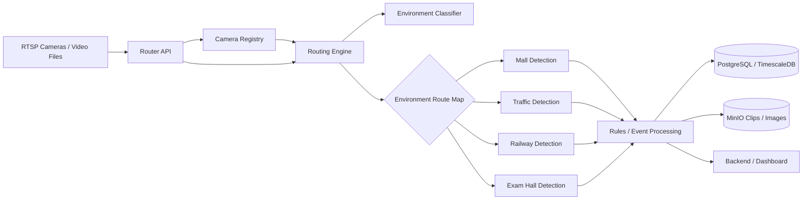
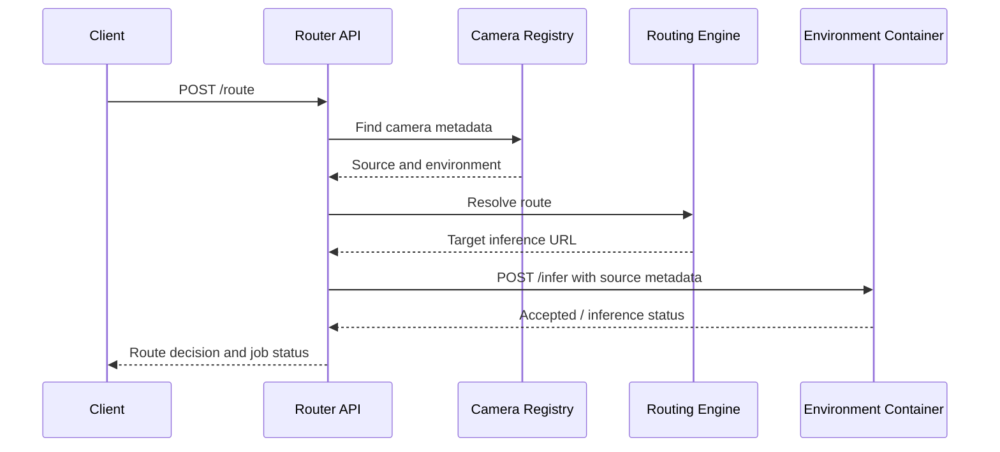

# Vision AI Routing Architecture

## Purpose

The routing layer receives a camera or video source, determines its operating
environment, and selects the correct environment-specific inference service.

It routes the source reference and metadata. It does not normally copy the
video bytes between containers. The selected inference container reads the
RTSP source through the Docker network or reads a shared video volume.

## High-level architecture



## Components

### `api.py`

Provides the HTTP interface:

| Endpoint | Purpose |
|---|---|
| `GET /health` | Check whether the router is running |
| `GET /cameras` | List registered cameras |
| `POST /cameras` | Register or update a camera |
| `POST /route` | Resolve a source to an inference service and create a stream job |
| `GET /streams` | List routing jobs |
| `POST /streams/{job_id}/stop` | Stop a logical stream job |

### `camera_registry.py`

Stores camera metadata:

```json
{
  "camera_id": "mall-camera-01",
  "source": "rtsp://mall-camera/stream",
  "environment": "mall",
  "enabled": true
}
```

The registry is the preferred source of truth because a camera's physical
location is known when the camera is installed.

### `environment_classifier.py`

Determines the environment when it is not supplied by the request or camera
registry.

The selection order is:

1. Explicit request environment
2. Registered camera environment
3. Optional frame-classification model
4. Development fallback based on camera/source keywords
5. Reject the request if the environment is still unknown

The supported environments are:

```text
mall
traffic
railway
exam_hall
```

The keyword fallback is useful for development only. For production, cameras
should be registered with an explicit environment.

### `routing_engine.py`

Combines camera metadata, environment selection, and the route map. It returns
a `RouteDecision` containing:

```json
{
  "camera_id": "mall-camera-01",
  "source": "rtsp://mall-camera/stream",
  "environment": "mall",
  "target_url": "http://mall_detection:8001/infer",
  "reason": "camera registry"
}
```

The default route map is:

```text
mall      → http://mall_detection:8001/infer
traffic   → http://traffic_detection:8002/infer
railway   → http://railway_detection:8003/infer
exam_hall → http://exam_detection:8004/infer
```

### `stream_manager.py`

Creates and manages logical stream jobs. A job contains:

```text
job_id
camera_id
source
environment
target_url
status
```

When dispatching, it sends a JSON request to the selected inference service:

```json
{
  "job_id": "generated-job-id",
  "camera_id": "mall-camera-01",
  "source": "rtsp://mall-camera/stream",
  "environment": "mall"
}
```

The target container then opens the source and runs its own inference pipeline.

## Request lifecycle



## Example: mall camera

Request:

```json
{
  "camera_id": "mall-camera-01"
}
```

The registry returns:

```text
environment = mall
source = rtsp://mall-camera/stream
```

The routing engine selects:

```text
http://mall_detection:8001/infer
```

The mall container then runs:

```text
YOLO detection
    ↓
ByteTrack tracking
    ↓
Shopping / loitering rules
    ↓
Standardized event
```

## Example: unknown source

Request:

```json
{
  "camera_id": "unknown-camera",
  "source": "C:/videos/traffic-junction.mp4"
}
```

If no registry entry exists, the development classifier can infer `traffic`
from the source name and select:

```text
http://traffic_detection:8002/infer
```

For an ambiguous source, the router rejects the request instead of guessing.
This prevents a classroom video from accidentally being sent to a traffic
model.

## Docker networking

Docker Compose service names act as internal DNS names. For example:

```yaml
services:
  camera_router:
    build: ./router

  mall_detection:
    build: ./containers/mall

  traffic_detection:
    build: ./containers/traffic
```

Inside the Docker network, the router can reach:

```text
http://mall_detection:8001/infer
http://traffic_detection:8002/infer
```

These service names may not resolve from the host machine. That is expected;
they are intended for container-to-container communication.

## Failure handling

The router should reject or mark a job as failed when:

- The camera is not registered and the environment cannot be determined.
- The environment is unsupported.
- No route exists for the selected environment.
- The inference container is unavailable.
- The inference container returns an HTTP error.

The next production improvements should be health checks, retry with backoff,
active stream reconnection, load balancing, and a persistent registry in the
database.
